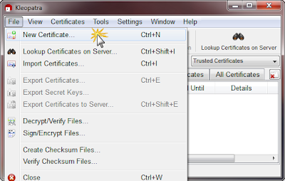
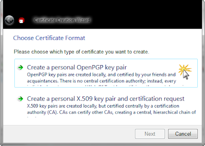
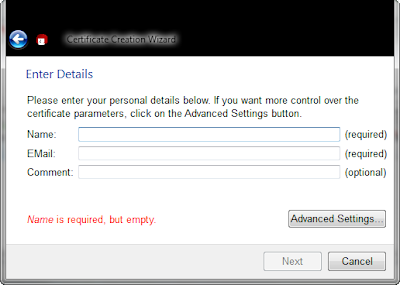
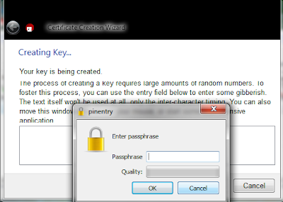
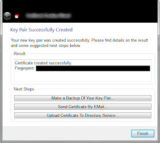
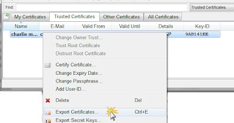

# Creating your own private and public key

## Overview:
There are two types of personal keys that you can provide.  The first is a simple personal PGP key.  The second is a x.509 key that is signed by an Certification Authority (and you have to pay for this service). 

## Creating Your own personal PGP Key:
From the File tab, select New Certificate...

Then select Create a personal OpenPGP key pair

Enter in your personal information

Approve the settings and in the next window, select Create Key.

Enter in a [good passphrase](http://en.wikipedia.org/wiki/Password_strength) that will be your password you will need to use when encrypting/signing and decrypting files.

When this is completed, you will have created both a [public and private key pair](http://en.wikipedia.org/wiki/Public-key_cryptography).  You will want to put you public key someplace where everyone can access it (like a website like this), and put your private key somewhere very secure where no one can get it, but where you can access it when you need it.  If you loose the private key, you would not be able to access any files that were encrypted, so it's not a bad idea to make a backup and keep it someplace safe. 

To save your private key, select Make a Backup Of Your Key Pair.. then select where to put the file, check the ASCII armor button, and OK. 

This will create a text file that you can offload and save someplace secure.

## Export your Public Key:
You will want to pass around your public key so that folks can send you encrypted files, or confirm that you signed a plaintext file.  To get a copy of your public key, right click on your key in the Trusted Certificates tab and select Export Certificates...

save the file name as `{your_email_address}.asc`.  The resulting will be a text file that users can use and import into their key chains. 
